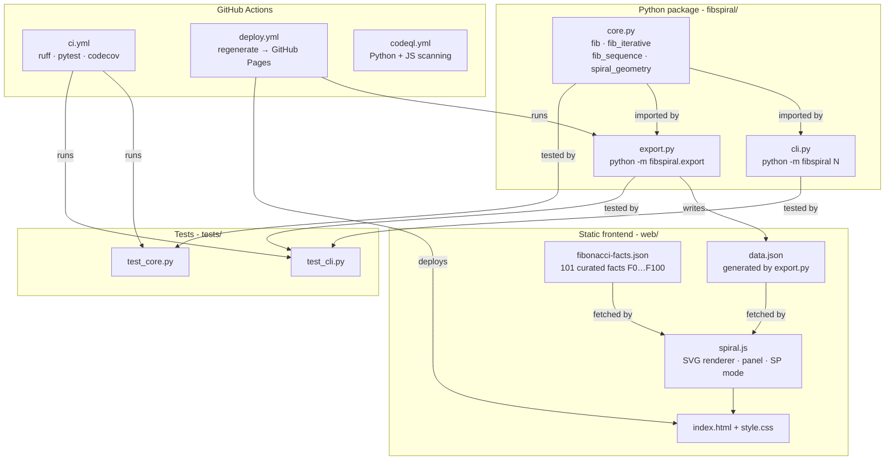

# fibonacci-spiral φ

[](https://github.com/benjamintokgoez/fibofun/actions/workflows/ci.yml)
[](https://github.com/benjamintokgoez/fibofun/actions/workflows/deploy.yml)
[](https://github.com/benjamintokgoez/fibofun/actions/workflows/codeql.yml)
[](LICENSE)
[](https://python.org)
[](https://github.com/astral-sh/ruff)

> A Python + static-web project that computes Fibonacci numbers with a tested
> CLI and renders an interactive golden spiral on a webpage where each square
> is clickable — showing its index, value, ratio to the previous term
> (converging toward **φ ≈ 1.618…**), and a curated fact.  
> A **Story Points Mode** re-skins every square with Agile planning-poker
> interpretations.

---

## Architecture



---

## Try it

### CLI
```bash
python -m fibspiral 12
# Prints F(0)…F(12) with ratios converging toward φ
```

### Generate / refresh the spiral data
```bash
python -m fibspiral.export web/data.json
# Writes 12 squares with arc geometry, ratios, and bounding-box metadata
```

### Open the frontend locally
```bash
# Any static file server works; Python's built-in is easiest:
cd web && python -m http.server 8080
# Then visit http://localhost:8080
```

Click a square → side panel shows Fibonacci index, value, ratio, a category
badge, and a fact drawn from `fibonacci-facts.json`.  
Toggle **Story Points Mode** in the top bar to re-skin every square with an
Agile planning-poker interpretation.

---

## Project layout

```
fibofun/
├── fibspiral/           # Python package (no runtime deps)
│   ├── __init__.py
│   ├── __main__.py      # python -m fibspiral
│   ├── core.py          # fib · fib_iterative · fib_sequence · spiral_geometry
│   ├── cli.py
│   └── export.py        # python -m fibspiral.export
├── tests/
│   ├── test_core.py     # 60+ assertions; ≥90% coverage
│   └── test_cli.py
├── web/
│   ├── index.html
│   ├── style.css
│   ├── spiral.js        # vanilla JS, no bundler
│   ├── data.json        # generated — do not edit by hand
│   └── fibonacci-facts.json
├── .github/
│   ├── workflows/
│   │   ├── ci.yml
│   │   ├── deploy.yml
│   │   └── codeql.yml
│   ├── ISSUE_TEMPLATE/
│   │   ├── bug.md
│   │   └── feature.md
│   ├── PULL_REQUEST_TEMPLATE.md
│   └── CODEOWNERS
├── .devcontainer/
│   └── devcontainer.json
├── pyproject.toml
├── LICENSE
└── README.md
```

---

## Development setup

### Codespaces (one click)
Click **Code → Open in Codespaces** — the devcontainer installs Python 3.12,
`ruff`, `pytest`, and `pytest-cov` automatically.

### Local
```bash
git clone https://github.com/benjamintokgoez/fibofun.git
cd fibofun
python -m venv .venv && source .venv/bin/activate
pip install -e ".[dev]"
```

### Run tests
```bash
pytest                                # quick pass/fail
pytest --cov=fibspiral --cov-report=term-missing   # with coverage
```

### Lint
```bash
ruff check fibspiral/ tests/
```

---

## Story Points Mode

Fibonacci numbers are the foundation of planning poker.  When Story Points
Mode is active each square shows:

| Value | Label | Interpretation |
|------:|-------|----------------|
|     1 | 1 SP  | Trivial change (config tweak, one-line fix) |
|     2 | 2 SP  | Small, well-understood task (CSS, copy update) |
|     3 | 3 SP  | Standard small task (simple CRUD endpoint) |
|     5 | 5 SP  | Medium task with some unknowns (new component + API) |
|     8 | 8 SP  | Complex feature, may need a spike (new auth flow) |
|    13 | 13 SP | Large — likely should be split (3rd-party integration) |
|    21 | 21 SP | Too big to commit — MUST be split before the sprint |
|   34+ | 34+ SP | Epic territory |
|   55+ | 55+ SP | Initiative territory |
|   89+ | 89+ SP | Initiative territory |
|  144+ | 144+ SP | Project territory |

---

## License
[MIT](LICENSE) © 2026 benjamintokgoez
